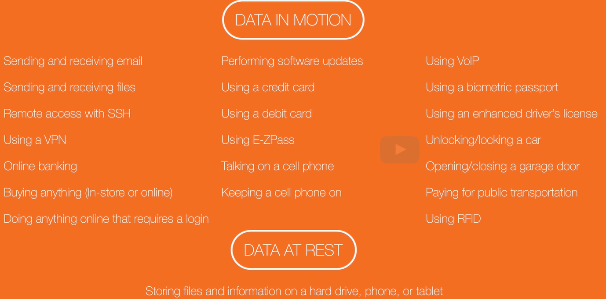

# Cryptography
- Is the practice and science of secure communication techniques
- Allows for confidentiality, where, sender of a message and the intended recipient understand it.
- Allows for integrity which makes sure that no part of a message changed in transit.
- Allows for authentication where somone can prove that they are who they claim to be. 
- Non-repudiation: Where the sender of a message can't deny having sent it.
- Protects data at rest in the same ways.

## Cryptanalysis
- Is the science of breaking cryptographic systems, codes, and algorithms.
- Before cryptosystems, codes and algorithms are declared secure, they've got to be analyzed thoroughly. Researchrs check to see if they can broken.

## Cryptology
- Refers to scientific and mathematical study of both cryptograpy and cryptanalysis.

## Encryption
- 
- Used to protect the confidentiality of our sensitive data while it's being transmitted and stored.

## Plaintext
- Is a message or a file of any type in human readable form.
- Any data in a form (like: binary) that can be viewed/used without converison.
- When a message is sent as plaintext across an insecure channel, an attacker can get a copy, and understand the message, just like the intended recipient.
- In secure channel can be:
  - The Internet.
  - The Air for cellular networks.
  - The WiFi.

## Ciphertext
- Is a compination of: **Plaintext** + **key** + **string of 1s and 0s**  are inserted into a **cipher** by using **encryption algorithm**.
- When message is sent as ciphertext across insecure channel, an attacker can get a copy, but the ciphertext will look like random bits and will contain no information that is usefull of meaningfull for the attacker.
- Intended recipient has the key and puts it and teh ciphertext into the cipher. out pops the plaintext.
- An encryption algorithm by itself is not sufficient because it's not secret, but with the secret key its  sufficient.