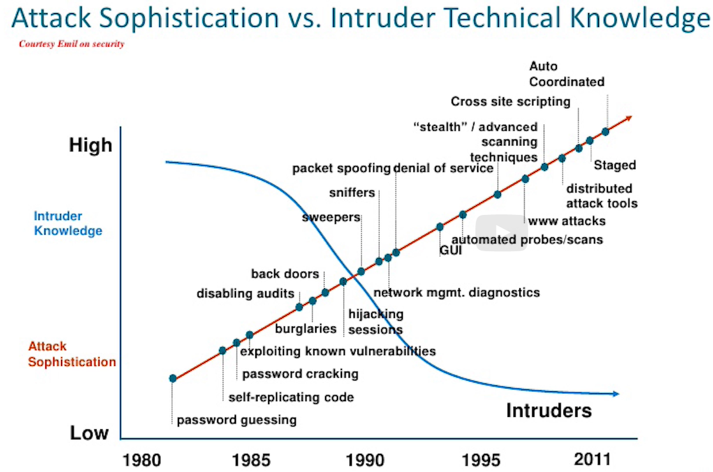

#  Who are the hackers?!
- Is someone who thinks outside the box.
- is technologically-inclined and finds unconventional solutions to problems, focusing on what is important.
- The term originally didn't have any maliciouse connotation, but now it does .
- Chracker was the original term for a malicious hacker.
- Are identified by the color of thei hats.

## Types of hackers:
- **Black** hat hacker: is the cracker, or malicious hacker.
- **White** hat hacker: Does what a black hat hacker does, breaking into companies and systems, with their permission, of course, in hopes of finding and exploiting vulnerabilities, So the company can fix those vulnerabilities before a black hat hacker can get in.
- **Gray** hat hacker: Is somewhere in the middle one type of grey hat hacker might break into a system and prove it to the administrator. then the grey hat will request payment to fix it, and if denied will move on without any malicious actions.

## Types of security jobs:
- Security researcher: Finding vulnerabilities anywhere.
- Penetration tester: Finding vulnerabilities within a certain company.
- Security Architect: Building systems and processes to establish a cyber security presence.

## Hackers motivitions:
- Money.
- Ideology.
- Compromise or coercion.
- Ego or extortion.
- Entertainment.
- Cause (They hack to expose corruption, protest government actions, or support a movement).
- Entrance (Some hackers break into systems just to see if they can).
- Status (Some hackers want to prove their skills and gain respect in the hacker community).

## Attackers could be:
- Outsiders.
- Competition.
- Activists.
- Organized crime.
- Terrorists.
- Governments.
- Hired guns.
- Insiders.
- Disgruntled employees.
- Customers.
- Suppliers.
- Vendors.
- Business partners.
- Contractors.
- Temps.
- Consultants.

Due to the rapid development of tools the attack sophistication and the intruder technical knowledge are sharply going in opposite directions.

